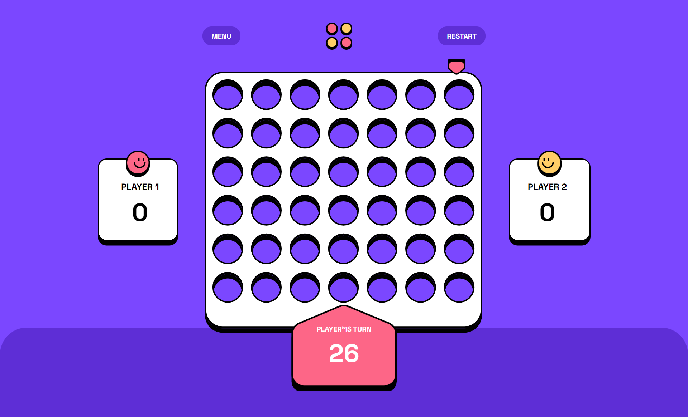
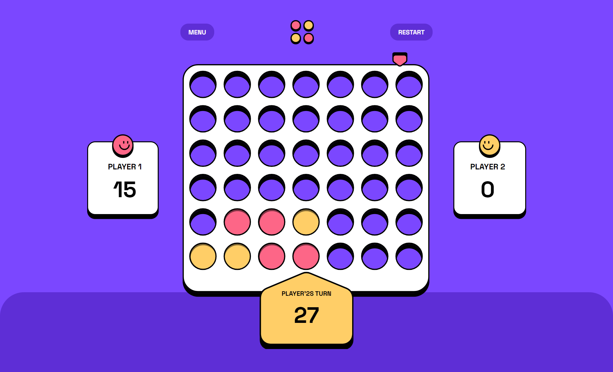
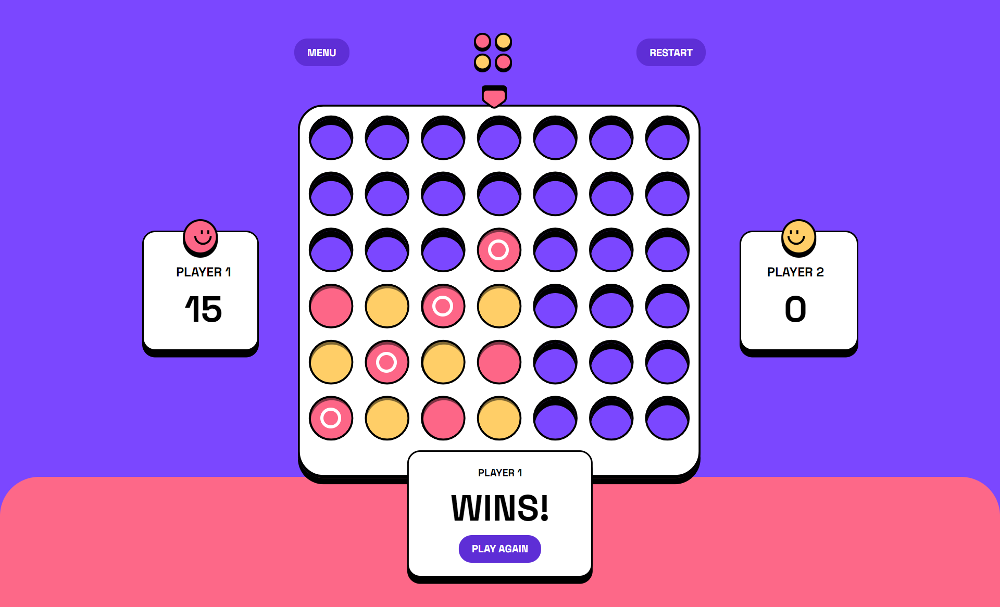
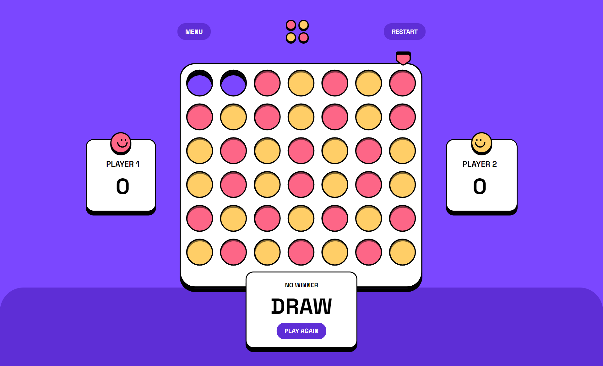
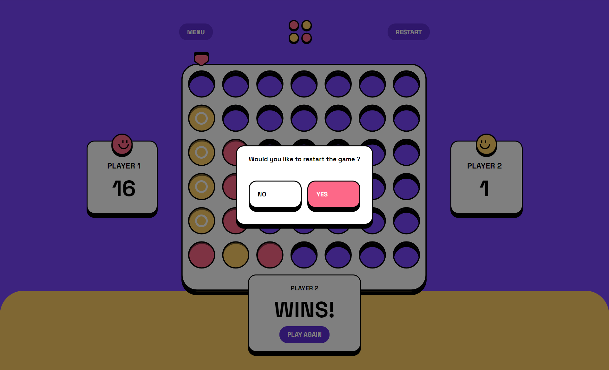
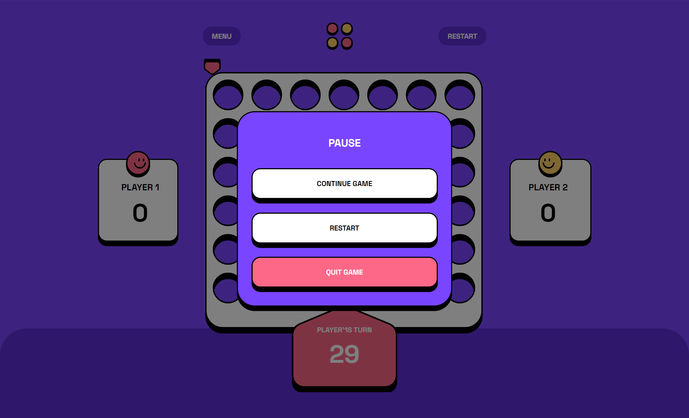
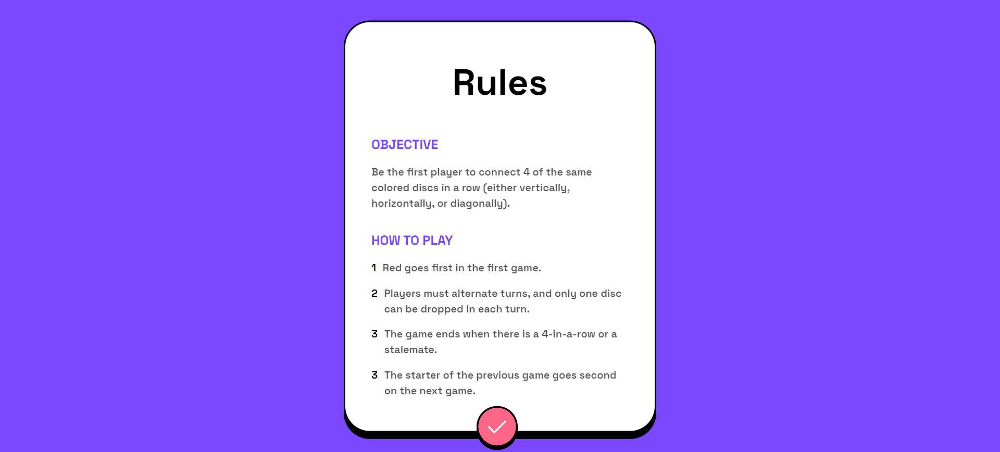
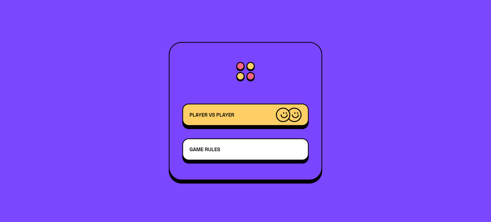
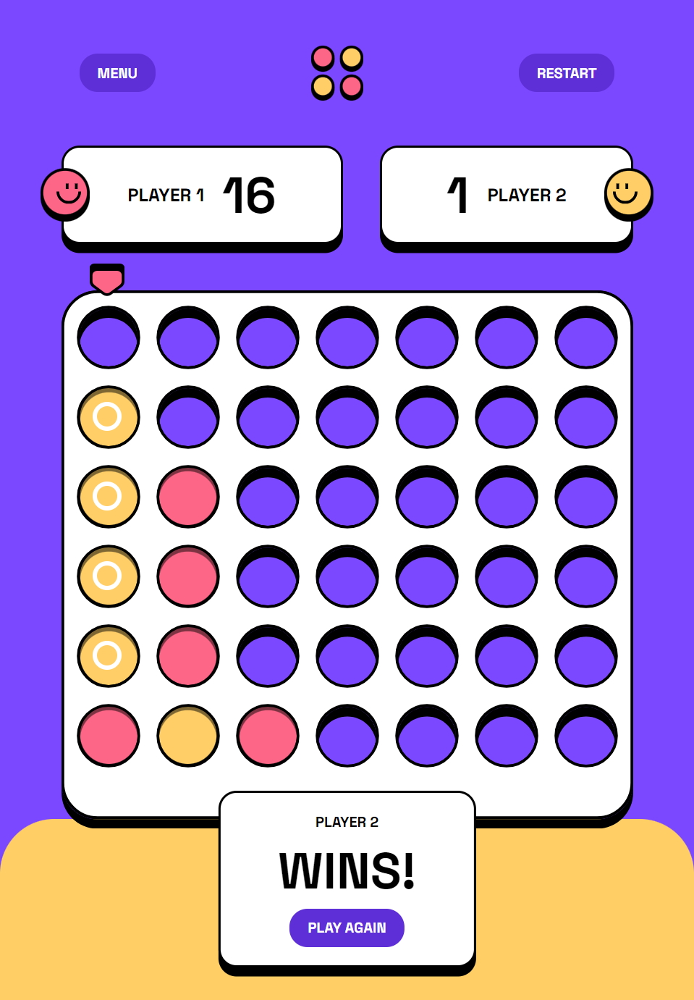
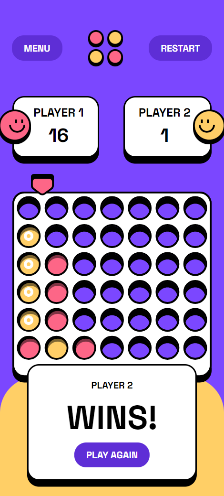

# Frontend Mentor - Connect Four game solution

This is a solution to the [Connect Four game challenge on Frontend Mentor](https://www.frontendmentor.io/challenges/connect-four-game-6G8QVH923s). Frontend Mentor challenges help you improve your coding skills by building realistic projects.

## Table of contents

- [Overview](#overview)
  - [The challenge](#the-challenge)
  - [Screenshot](#screenshot)
  - [Links](#links)
- [My process](#my-process)
  - [Built with](#built-with)
  - [What I learned](#what-i-learned)
  - [Continued development](#continued-development)
  - [Useful resources](#useful-resources)
- [Author](#author)
- [Acknowledgments](#acknowledgments)

**Note: Delete this note and update the table of contents based on what sections you keep.**

## Overview

### The challenge

Users should be able to:

- View the game rules
- Play a game of Connect Four against another human player (alternating turns on the same computer)
- View the optimal layout for the interface depending on their device's screen size
- See hover and focus states for all interactive elements on the page
- **Bonus**: See the discs animate into their position when a move is made
- **Bonus**: Play against the computer

### Screenshot

## My process

### Built with

- Semantic HTML5 markup
- CSS custom properties
- Flexbox
- CSS Grid
- Mobile-first workflow
- [React](https://reactjs.org/) - JS library

## Author

- Frontend Mentor - [@korg01wfd](https://www.frontendmentor.io/profile/korg01wfd)
